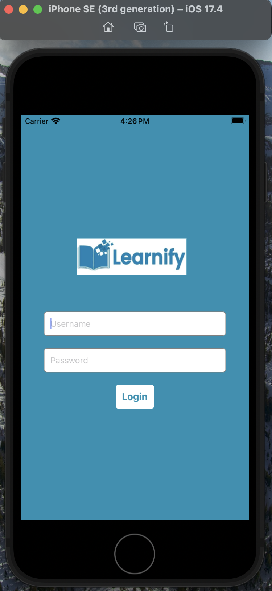
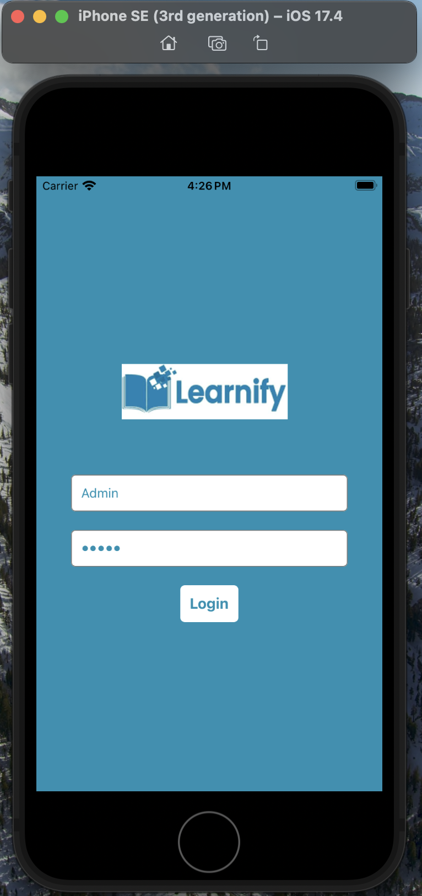
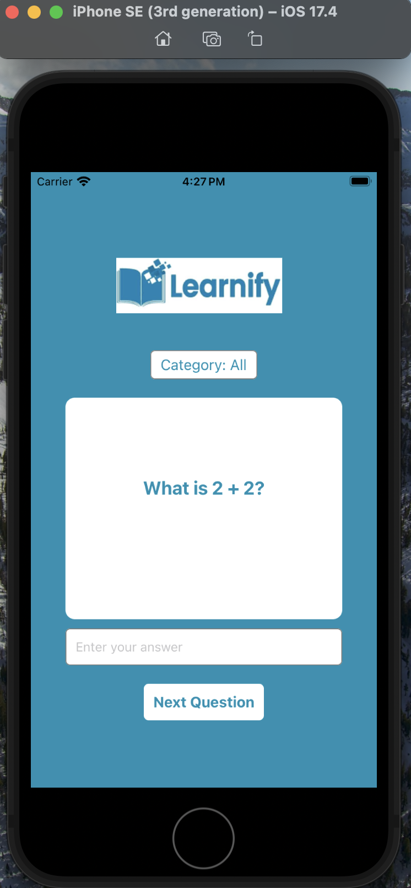
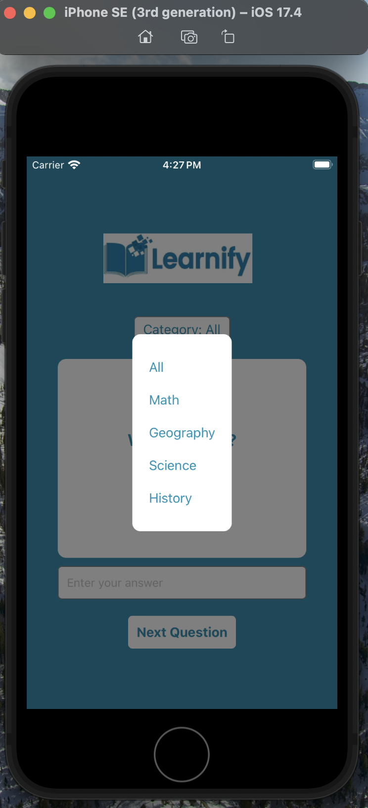
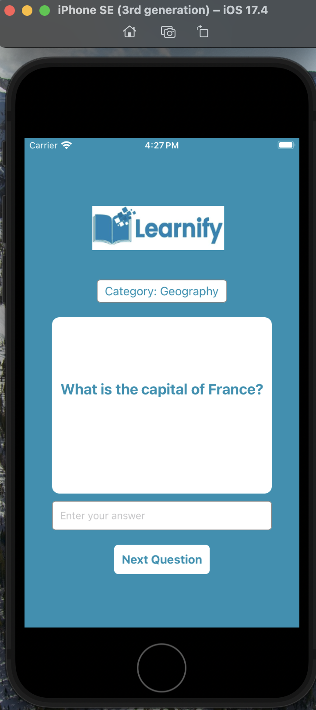
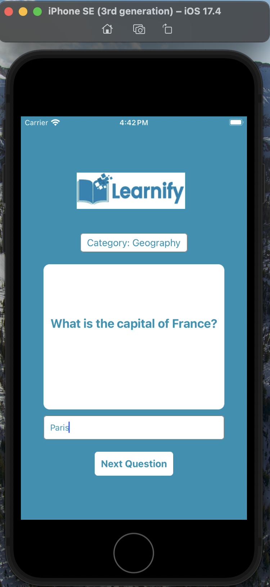
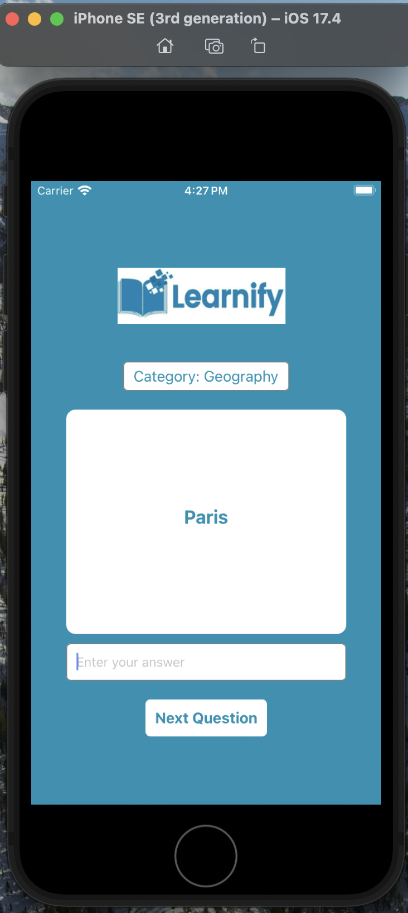
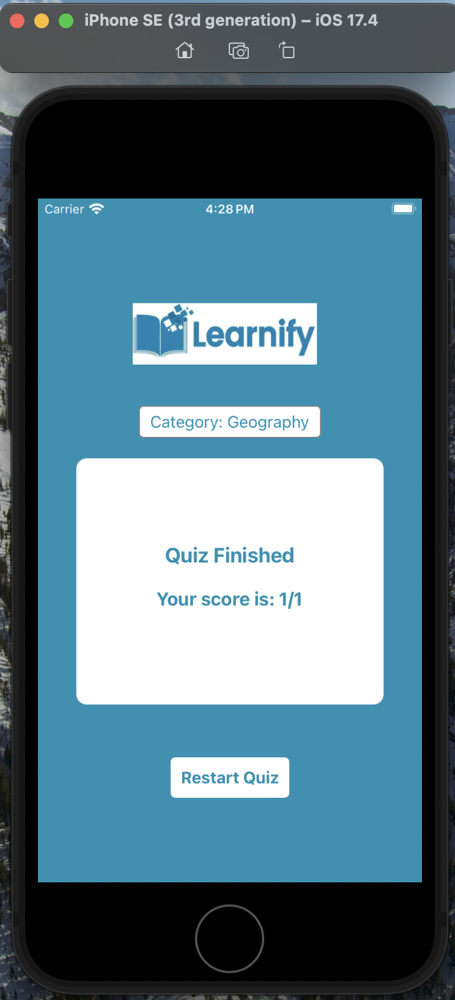

# Learnify(Personalized Flashcard Quiz)

This mobile application Learnify is a flashcard quiz application to revolutionize traditional learning methods by having interactive platform where users can have memorization across various topics. Main goal of this application is to address the challenges faced by everyday normal learning methods, to replace those methods with users study cards having questions and answers on different topics. This mobile application also allows users to track their progress based on their learning experiences.

Target users of this application are students and any learners seeking effective memorization techniques. UI of this application is user-friendly and is designed to be visually appealing, easy to navigate. Key screens include Login, Dashboard (for topic selection), Flashcards (displaying questions), Results, and Settings. The design emphasizes simplicity and usability to enhance the overall learning process.

## Start your Application

Let Metro Bundler run in its _own_ terminal. Open a _new_ terminal from the _root_ of your React Native project. Run the following command to start your _Android_ or _iOS_ app:

### For Android

```bash
# using npm
npm run android

# OR using Yarn
yarn android
```

### For iOS

```bash
# using npm
npm run ios

# OR using Yarn
yarn ios
```
For **Android**: Press the <kbd>R</kbd> key twice or select **"Reload"** from the **Developer Menu** (<kbd>Ctrl</kbd> + <kbd>M</kbd> (on Window and Linux) or <kbd>Cmd ⌘</kbd> + <kbd>M</kbd> (on macOS)) to see your changes!

For **iOS**: Hit <kbd>Cmd ⌘</kbd> + <kbd>R</kbd> in your iOS Simulator to reload the app and see your changes!
   
## Screenshots

Following screenshots depict the login process of user into this mobile application:

{:width="50%"}

{:width="50%"}

Following screenshot show the home screen of Learnify app:

{:width="50%"}

Following screenshot show the category selection screen, where user can select the category of quiz:

{:width="50%"}

Following screenshot show the Flashcards page, where user can see Quiz questions based on the selected category which is "Geography" here:

{:width="50%"}

Following screenshot show the Flashcards page, where user can input answers for the quiz question. Score is calculated baed on these inputs which is displayed at the end:

{:width="50%"}

Following screenshot show the Flashcards page, here user can learn about the Quiz question by flipping question card. This shows Quiz answer to the user:

{:width="50%"}

Following screenshot show Quiz Finished page, where user score of the quiz is displayed. This page also has an option for user to Restart Quiz:

{:width="50%"}

## Video Demonstration

Following url has video demonstrating the working of this application: 

[Demo_url](https://drive.google.com/file/d/1ykGJzWW4i2Zf1XkIe0FDdhy3RMKjfpOR/view?usp=sharing)
